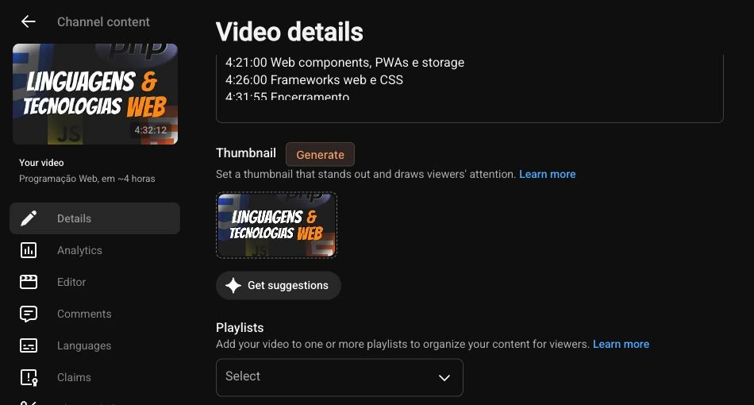

# YouTube Localizer

Translate your video's title, description and thumbnail text, or generate a new thumbnail using your own reference images. A browser extension by [OpenPost](https://openpo.st) for Chromium and Firefox.

Use your existing YouTube Studio session and your own AI API keys. Everything is stored in your browser; generation requests go directly to the provider you choose.



The **Generate** button beside a real video’s thumbnail in YouTube Studio.

## What you can do

- Generate missing translations and approve all ready results in one click. Review and edit whenever you want.
- Keep multiple YouTube accounts connected, with separate languages, glossaries and history for each channel.
- Generate original thumbnails with GPT Image 2.5 Sunburst, the default image model. Save face, brand and style references for later videos.
- Edit thumbnail text with GPT Image, Ideogram 4.5 Edit or Nano Banana models.
- Prepare editable text layers once with Ideogram, then render more languages locally without another image-generation request.
- Export and restore your reference library, generated assets and work history.

## Install

Requires Chromium 120+ or Firefox 142+. YouTube Studio must be in English.

### Build from source

Use [Devenv](https://devenv.sh/) to enter the project's Node.js 24 environment:

```sh
devenv shell
npm ci
npm run build
```

### Chromium

1. Open `chrome://extensions` and enable **Developer mode**.
2. Choose **Load unpacked** and select this project's `dist/` directory.
3. Pin YouTube Localizer. Open YouTube Studio and click the extension icon to open its side panel.

### Firefox

1. Run `npm run build:firefox`.
2. Open `about:debugging#/runtime/this-firefox`.
3. Choose **Load Temporary Add-on** and select `dist-firefox/manifest.json`.
4. Open YouTube Studio and click the extension icon to open its sidebar.

Temporary Firefox installations last until the browser closes. For a persistent installation, use a Mozilla-signed release.

## Translate a video

1. Open the channel's **Content** page or a video's **Details** page in Studio.
2. Open the extension and select **Read current Studio page**.
3. Open **Settings**, add your provider's API key, choose the channel's source and target languages, and save.
4. Select videos and choose **Check missing translations**, then **Generate missing**.
5. Choose **Approve all**. Use **Review** if you want to edit individual results.
6. Choose **Apply approved**. The extension brings its Studio working tab forward. Keep it visible until the run finishes.

The extension preserves existing translations and checks Studio again before writing. It writes localized titles, descriptions and thumbnails through language dialogs. Audio, subtitles and publication settings stay unchanged.

Thumbnail translation must be enabled under Settings → Languages → Thumbnails. For image edits, confirm the visible source text in Review, generate and approve its translated wording, then generate the images. The side panel offers **Set up thumbnails** when these inputs are missing. When thumbnails are disabled, the action is labelled **Generate text**. Choose **Use another image** if the Studio preview is too small.

For another account, select **Add account**, switch accounts in Studio and select **Read current Studio page**. Choose connected channels from the channel picker. Each run works on one channel.

## Generate a thumbnail

Open a video's **Details** page in Studio and click **Generate** beside the thumbnail heading. The composer opens with the video's title and description. You can also open it from the extension header or choose **Generate thumbnail** in Review.

1. Describe the scene, layout and headline.
2. Choose **Add images** to save references, then select the ones to use for this thumbnail.
3. Add a Fal API key under **Fal connection** and select **Generate**.
4. Download the result to upload in Studio, or choose **Use for localization** to create language variants from it.

References stay local until you select them for generation. Saved variants remain available when you reopen the composer. Downloads are 1280 × 720 JPEGs; generating an original thumbnail does not upload it to Studio.

## Reuse editable thumbnail text

Choose **Ideogram editable text** in Settings and add a Fal API key. In Review:

1. Select **Prepare text layers** for the source thumbnail. This makes one paid Layerize request, reused for the same source image.
2. Correct the extracted text boxes. Use **Adjust layout** for fonts, size, position and styling, then **Approve layout**.
3. Enter each language's wording or generate translations with your text provider. Approve the wording and select **Generate missing** to render the variants.

Rendering from saved layers is local and makes no image-generation request. Manual wording keeps subsequent variants entirely local; AI translation uses your text provider. You may need to adjust fonts or text boxes to match the original lettering.

## Providers and stored data

Text generation supports OpenAI, OpenRouter, Anthropic and custom endpoints, including local servers. Selecting Custom endpoint exposes its Base URL directly. Fal handles all image generation and editing. Image localization supports GPT Image 2.5 Sunburst and Flare, Ideogram 4.5 Edit, Nano Banana models and Ideogram editable text. Choose the image model in Connection; quality settings are under **Advanced**; Ideogram Edit defaults to `very_low` quality.

Provider usage is billed to your API account. Completed results are cached. Fal receipts survive restarts and resume retrieval without another submission. A submission interrupted before its receipt is saved requires checking the provider before another paid attempt.

API keys are session-only by default and are cleared by an extension reload or browser restart. Select **Remember keys on this device** in Connection before saving to keep them across restarts. Text keys are bound to their saved endpoint. Keys stay out of backups and sync storage. The extension has no telemetry, and OpenPost receives no video or image data.

Use **Backup & keys** in Settings to export your work before uninstalling. Backups contain images and history, so keep them private. After importing, reconnect accounts and review results before applying them.

Optional **Translation notes** preserve names and terminology. **Max paid requests per batch** caps new AI submissions in a localization batch. Both are under Advanced.

## Development

Run commands from the project directory inside `devenv shell`.

```sh
npx playwright install chromium firefox
npm run dev              # UI preview at http://127.0.0.1:4397/review.html?preview=1
npm run check            # Svelte, TypeScript, ESLint and formatting
npm test                 # Unit tests
npm run test:browser     # Packaged Chromium and native Firefox tests
npm run verify           # All checks and tests
npm run check:firefox     # Build and lint the Firefox package
npm run package          # Chromium ZIP in artifacts/
npm run package:firefox   # Firefox ZIP in artifacts/
```

Tests use isolated browser profiles, intercepted Studio/provider responses and fixture credentials. For live Studio validation, follow the [scheduled-video pilot](docs/pilot.md).

The UI uses Svelte 5, Vite and `@openpost/ui`, with a fixed orange Dither theme and system light/dark appearance. Versioned UI packages are included in `vendor/`; a sibling OpenPost checkout is not required. See [architecture and package updates](docs/architecture.md), [product scope](PRODUCT.md) and [contributor instructions](AGENTS.md).

## Chrome Web Store releases

A matching version tag runs verification, uploads the Chromium package and submits it for Google review. Follow [the one-time publisher and GitHub setup](docs/chrome-release.md) before the first release.

## Firefox releases

The **Submit Firefox release** workflow submits a listed version to Mozilla Add-ons on a `v<package version>` tag or manual dispatch. Set `AMO_API_KEY` and `AMO_API_SECRET` in the repository's `firefox` environment. The workflow verifies the extension and uploads its build source for Mozilla review. Listing metadata lives in [docs/amo.json](docs/amo.json).

## License

[AGPL-3.0-only](LICENSE).
